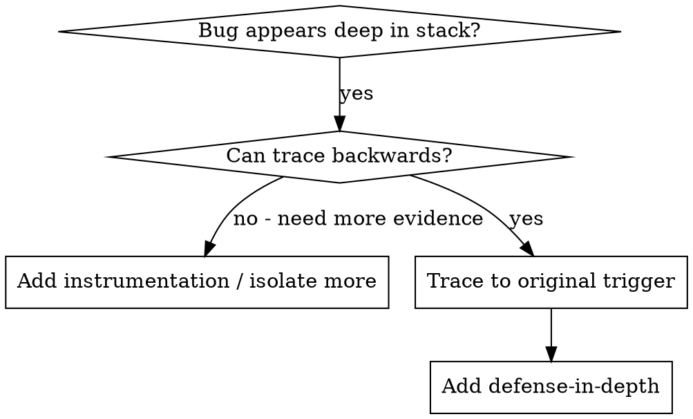
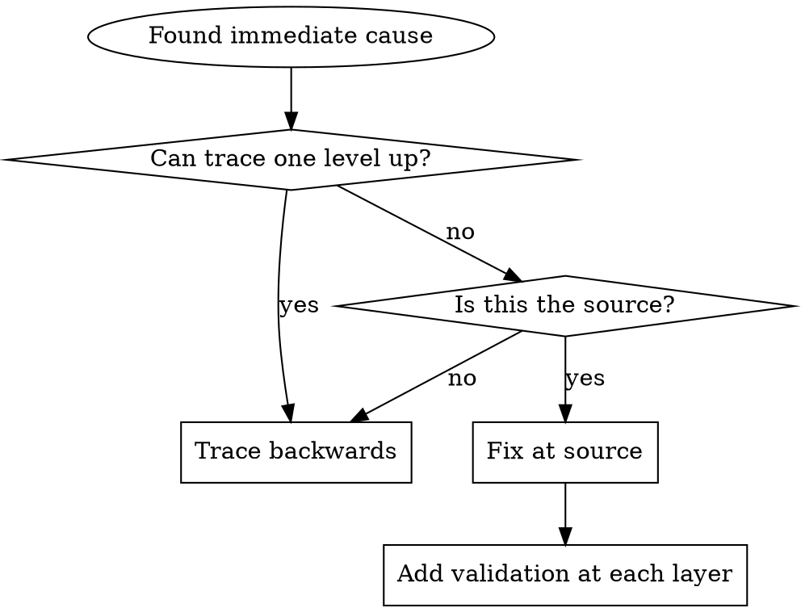

# Root Cause Tracing

## Overview

Bugs often manifest deep in the call stack. Your instinct is to fix where the error appears — but that's treating a symptom. Trace backward through the call chain until you find the original trigger, then fix at the source.

## When to Use



Use when:
- Error happens deep in execution, not at the entry point
- Stack trace shows a long call chain
- Unclear where invalid data originated
- Need to find which test or caller triggers the problem

## The Tracing Process

### 1. Observe the Symptom
```
Error: git init failed in /Users/user/project/packages/core
```

### 2. Find Immediate Cause
What code directly causes this?
```typescript
await execFileAsync('git', ['init'], { cwd: projectDir });
```

### 3. Ask: What Called This?
```typescript
WorktreeManager.createSessionWorktree(projectDir, sessionId)
  → called by Session.initializeWorkspace()
  → called by Session.create()
  → called by test at Project.create()
```

### 4. Keep Tracing Up
What value was passed?
- `projectDir = ''` (empty string)
- Empty string as `cwd` resolves to `process.cwd()`

### 5. Find Original Trigger
Where did the empty string come from?
```typescript
const context = setupCoreTest(); // Returns { tempDir: '' }
Project.create('name', context.tempDir); // Accessed before beforeEach runs!
```

## Adding Stack Traces

When you can't trace manually, add instrumentation:

```typescript
async function gitInit(directory: string) {
  const stack = new Error().stack;
  console.error('DEBUG git init:', {
    directory,
    cwd: process.cwd(),
    nodeEnv: process.env.NODE_ENV,
    stack,
  });
  await execFileAsync('git', ['init'], { cwd: directory });
}
```

Use `console.error()` in tests — loggers may be suppressed.

Capture output:
```bash
npm test 2>&1 | grep 'DEBUG git init'
```

Look for: test file names, line numbers triggering the call, repeated patterns.

## Finding Which Test Causes Pollution

If the repository has no dedicated polluter-finding script, bisect the test set manually:

```bash
# Run half the candidate tests, then the other half.
# Keep halving until the polluter is isolated.
```

The key is the strategy, not a specific helper script: isolate the smallest test subset that still pollutes shared state, then trace why that test leaves residue behind.

## Key Principle



**Never fix just where the error appears.** Trace back to find the original trigger.

## Stack Trace Tips

- Use `console.error()` in tests — loggers may be suppressed
- Log before the dangerous operation, not after it fails
- Include: directory, cwd, environment variables
- Capture full call stack: `new Error().stack`
